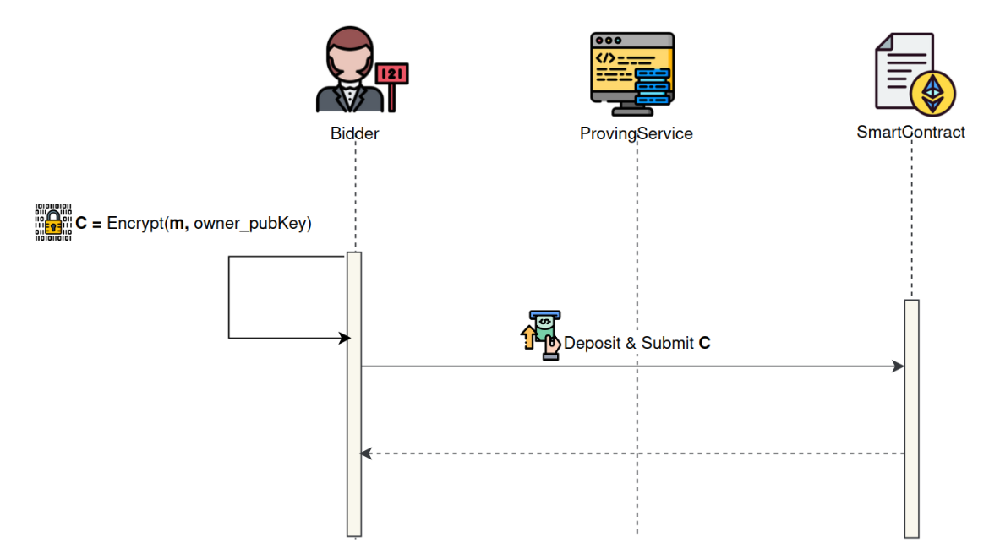
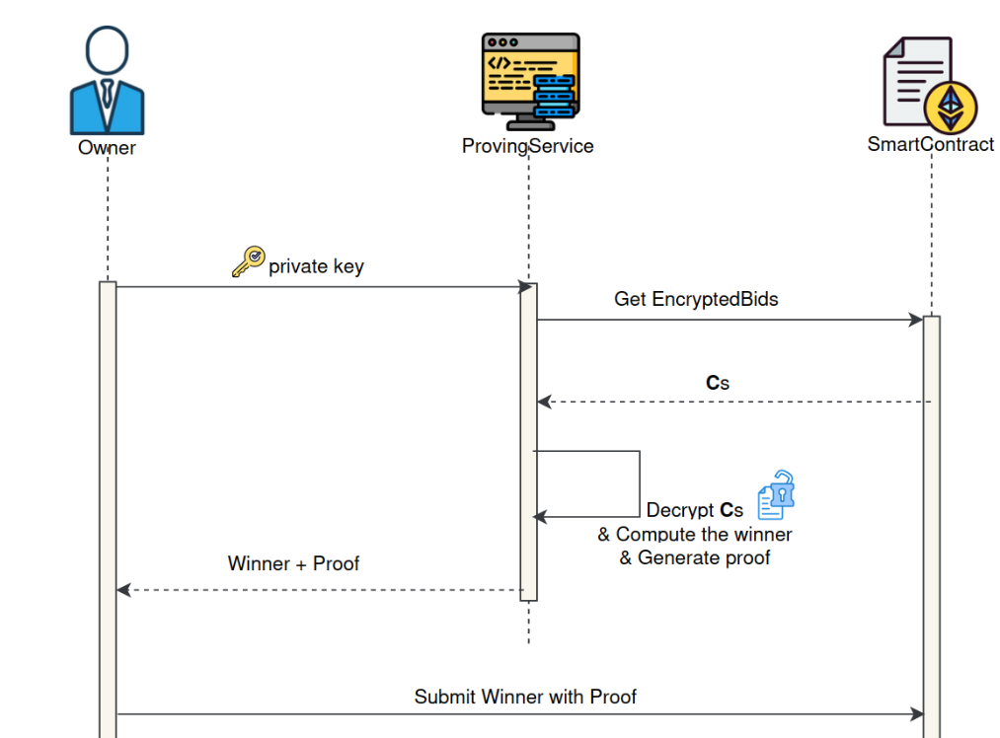
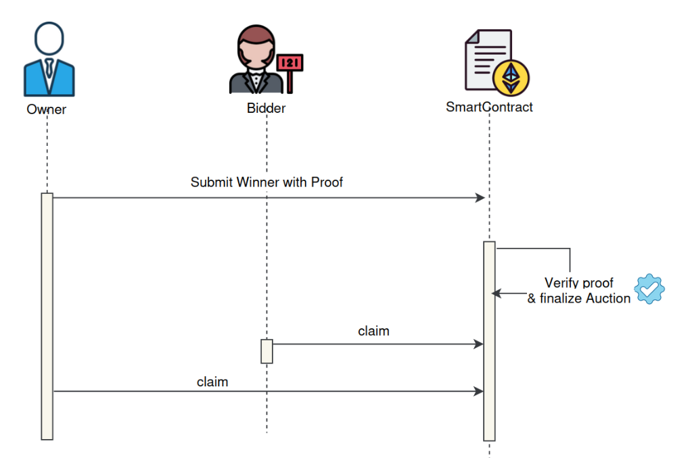

# SILENT-BID

## Introduction

**Silent Bid** is a [**Sealed-Bid Auction**](https://www.investopedia.com/terms/s/sealed-bid-auction.asp) platform built
using **Rust** and **Plonky3**. The project aims to facilitate secure and private auctions by leveraging
**zero-knowledge proofs (ZKPs)** to determine the highest bidder without revealing individual bid amounts. This serves 
as a **reference model** for developers interested in building dApps using **Plonky3** and **ZKPs**.

## Overview

### Core idea

Bidders submit encrypted bids to a smart contract, which only the auction owner can decrypt using their secret key. At
the conclusion
of the auction, the owner publishes the winner. **ZKPs** ensure that the auction owner reads all bids and selects the
highest one
without revealing their private key or any bid details.

Key components of the project include:

- **Proving Service**: Powered by **Plonky3**, this service generates a **zero-knowledge proof** from the execution trace of
  a program that decrypts bids and computes the winner, while preserving the confidentiality of individual bid amounts
  and the owner's private key.
- **Smart Contract**: The smart contract verifies the ZK proof and manages the entire auction lifecycle, including
  setup, bidding, and settlement.

### Technology Stack

- **Smart Contract**: Solidity
- **Circuit**: Rust, Plonky3
- **Encryption scheme**: RSA, Rolling Hash

### Workflow

The core logic of **SilentBid** operates on-chain, while off-chain processes handle the winner calculation and proof
generation. The auction process follows four main phases:

1. **Initial Setup**: The auction owner creates the auction, sets the required deposit amount, transfers assets to the
   smart contract,
   and defines the auction's start and end times.
2. **Bidding Phase**: Bidders submit their bids to the smart contract by depositing the required amount.
3. **Opening Phase**: After the bidding window closes, the auction owner calculates the winner and generates a
   zero-knowledge proof.
4. **Verification Phase**: The owner submits the winner and the proof to the smart contract for verification, concluding the
   auction.

**Sequence diagrams for each module are shown below:**

#### Auction Flow:

1. **Initial Setup**:

2. **Bidding Phase**:

3. **Opening Phase**:

4. **Verification Phase**:

### Implementation

Here is the documentation of how we implemented the [Proving Service](./document/proving_service.md).

